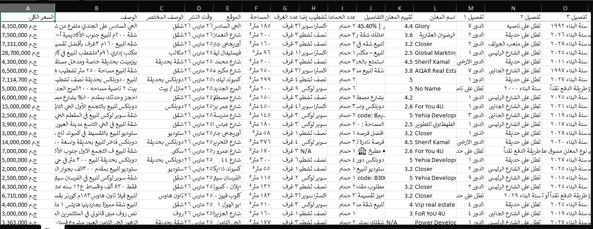
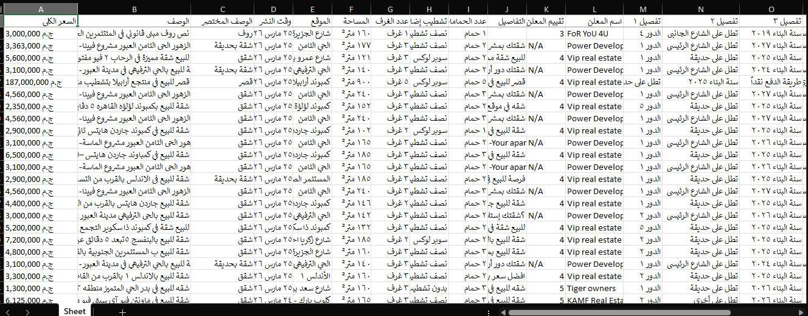

# Aqarmap Real Estate Scraper

A Python web scraper that extracts real estate listings from [Aqarmap.com.eg](https://aqarmap.com.eg), one of Egypt's largest property platforms.

## Demo




## Data Collected

| Field | Description |
|---|---|
| السعر الكلي | Total price |
| الوصف | Full description |
| الوصف المختصر | Short description |
| وقت النشر | Publish time |
| الموقع | Location |
| المساحة | Area in sqm |
| عدد الغرف | Number of rooms |
| تشطيب | Finishing type |
| عدد الحمامات | Bathrooms |
| تقييم المعلن | Owner rating |
| اسم المعلن | Owner name |

## Tech Stack

- Python
- Playwright
- OpenPyXL

## How to Run
```bash
pip install -r requiretments.txt
python main.py
```

## Output

Excel file with all listings, clean Arabic headers, frozen header row, and auto-fitted columns

## Disclaimer

This scraper is for educational and research purposes only. Use responsibly and respect the website's terms of service